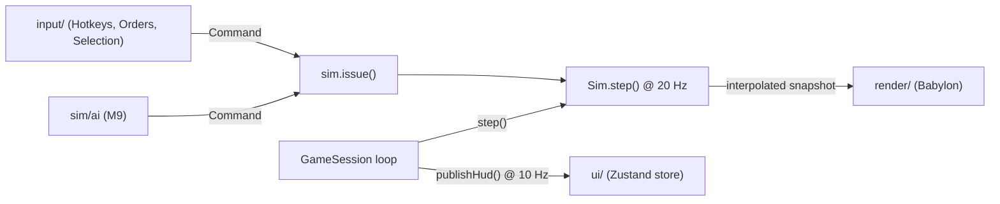

# bordev

A single-player 2.5D medieval RTS for the browser. It combines Command & Conquer–style base building with Age of Empires–style peasants, farms and ages. Two asymmetric factions, the feudal **Crown** and the northern **Clans**, fight skirmishes against AI on 128×128 isometric maps. Babylon.js draws the sprites, which are pre-rendered from procedurally modelled Blender scenes.

> **Status: early Alpha, not playable yet.** This README is for developers. The game design, locked decisions and technical contracts are in [`docs/plans/00-overview.md`](docs/plans/00-overview.md), which is the source of truth. Progress is tracked in [`docs/plans/01-alpha.md`](docs/plans/01-alpha.md).

## Current state

| Milestone | State |
|---|---|
| M0 Project foundation | ✅ done |
| M1 Sprite pipeline v1 (15 Blender assets, atlases, terrain textures) | ✅ done |
| M2 World rendering (iso camera, terrain, sprite batches, shadows, overlays) | ✅ done |
| M3 Simulation core (20 Hz fixed step, grid, A*, movement, determinism) | ✅ done |
| M4 Selection, orders and HUD shell | ✅ done |
| M5 Economy and construction | ⏭ next |
| M6–M9 Production, combat, fog, skirmish flow and AI | not started |

`npm run dev` loads `public/maps/alpha_test.json`, runs the sim at 20 Hz, and renders terrain, unit sprites, and overlays along with a debug scene (start units plus seeded Crown units for player 0). Selection (click, drag-box, Shift multi-select, double-click type selection, control groups 0–9), orders (contextual right-click, Shift queueing, rally points, stop, hold, delete), the React HUD (top bar resources, selection panel with portraits and stats, 3×5 command card), interactive minimap, and camera controls (pan keys, middle-drag, cursor wheel zoom, edge scrolling, Town Center jump) are fully implemented. The sim accepts `move`, `attackMove` (movement only), `stop`, `hold`, `delete`, and `setRally` commands. Other command kinds throw until their milestone systems are built. There is no AI yet (scheduled for M9).

## Prerequisites

| Tool | Version | Needed for |
|---|---|---|
| Node.js | 26.8.1 (`.nvmrc`, `engines: 26.x`) | everything |
| npm | 12 | `npm ci`. The pinned esbuild install script is allowed through `allowScripts` in `package.json` |
| Playwright Chromium | `@playwright/test` 1.63 | `npm run e2e` |
| Blender | 5.2 LTS on `PATH` as `blender` | regenerating art only |

Development runs on a headless Linux box with no GPU. Blender renders with Cycles on the CPU, and Playwright uses SwiftShader WebGL. You only need Blender to change art: the generated atlases, terrain textures and maps are committed under `public/`.

## Quick start

```sh
nvm use
npm ci
npm run dev        # Vite on :5173, bound to all interfaces (server.host: true)
```

On a headless machine, open `http://<host>:5173/` from another machine. When debug is enabled and the command slot is empty, `G` toggles the debug grid and Keep footprints. Middle-drag pans, and the wheel zooms around the cursor (0.5–1.5).

Do not use `npm install --force` or `--legacy-peer-deps`. See [TypeScript and lint toolchain](#typescript-and-lint-toolchain) for the reason.

## Commands

The script names are fixed by the overview. Arguments to tools go after `--`.

| Script | What it does |
|---|---|
| `dev` | Vite dev server with HMR and the debug hook enabled |
| `build` | `tsc -b && vite build` → `dist/` |
| `preview` | Serves `dist/` at `127.0.0.1:4173` (strict port, also used by e2e) |
| `test` / `test:watch` | Vitest (Node environment) over `src/**/*.test.ts` and `tools/**/*.test.ts` |
| `e2e` | Playwright specs in `tests/e2e/` against `npm run preview`. **Run `npm run build` first** |
| `lint` | ESLint, including the sim/data import seam (see below) |
| `typecheck` | `tsc -b` across all three TS projects |
| `art:build` | Renders sprites and terrain through Blender into `build/` (cached). `-- --asset <id>` renders one asset |
| `art:pack` | Packs `build/renders/` into `public/atlases/` (cached). `-- --asset <id>` packs one asset |
| `art:terrain` | Re-renders the six terrain textures directly, with no cache |
| `map:gen` | Deterministic map generator, e.g. `-- --seed 1 --players 2 --out alpha_test` |
| `bench:sim` | Headless sim tick benchmark, e.g. `-- --units 300` |
| `sim:headless`, `balance`, `desktop:dev`, `desktop:build` | Names are reserved but not implemented yet (the tool files and Electron are missing) |

### Before pushing

CI (`.github/workflows/ci.yml`, ubuntu-latest) runs these steps in this order:

```sh
npm run typecheck && npm run lint && npm test && npm run build && npm run e2e
```

When the job fails, CI uploads `playwright-report/` and `test-results/` as artifacts.

## Repository layout

```
src/
  main.tsx          React root → app/GameScreen
  app/              screens (GameScreen today; menus/setup/results arrive in M9)
  game/             GameSession: owns Sim, Renderer, InputController; fixed-step
                    loop, 10 Hz HUD publication, debug hook
  render/           Babylon: Renderer, IsoCamera, Terrain, SpriteBatch, AtlasCache,
                    UnitShadows, Overlays, ThinInstancePool, DebugScene, iso math;
                    overlays/ (geometryBuilder, DebugGrid, overlayShaders)
  sim/              PURE TypeScript simulation: sim, world, entity, commands, rng,
                    map, grid, spatialHash, path/ (A*, components, queue), systems/
  data/             typed design tables: roles (role predicates), units, buildings,
                    upgrades, ages, factions, combat, economy, terrain
  assets/           art manifest + atlas JSON types/parsers (shared with tools)
  input/            Hotkeys (single keyboard dispatcher), InputController,
                    SelectionController, OrderController, CameraController
  ui/               HudRoot (Hud), TopBar, SelectionPanel, CommandCard, Portrait,
                    Minimap, commandSlots, hud (Zustand store)
art/
  manifest.json     every renderable asset (id, kind, script, frame size, dirs, anims)
  blender/          render_asset.py, render_terrain.py, lib/ (rig, look, materials, …),
                    assets/<id>.py (one script per asset)
tools/              art-build, pack-atlas, mapgen, bench-sim (+ tests); eslint/ workspace
tests/e2e/          Playwright specs (boot, m4, m4-boundaries); fixtures/m4.ts
public/             GENERATED and COMMITTED: atlases/, terrain/, maps/
build/              GENERATED and IGNORED: raw renders, logs, caches
docs/plans/         overview + stage plans (alpha, beta, pre-release, release)
```

`RTS_STAGE_PLANS_PLAN.md` is the original planning brief that produced `docs/plans/`. Use `docs/plans/` instead.

## Architecture



- **GameSession ownership and loop.** `GameSession` owns the simulation (`Sim`), renderer (`Renderer`), and input dispatcher (`InputController`). It steps the sim at `SIM_DT = 0.05` s (20 Hz) using an accumulator, routes clamped frame delta to input, renders with `alpha = acc / SIM_DT` snapshot interpolation, and publishes game state to the Zustand HUD store at 10 Hz (every 2 sim ticks). Rendering and HUD publication never mutate sim state.
- **The sim/data seam.** `src/sim` and `src/data` may not import Babylon, React, the DOM, or `src/{render,ui,input,game,app}`. ESLint enforces this for static imports, `import()` and `import type`. `tsconfig.sim.json` also compiles these directories with ES2023 libs only, so no DOM or Node types are available. This keeps the sim runnable in Node for tests, benchmarks and the planned headless AI matches.
- **Determinism.** All randomness goes through `Rng` (mulberry32, seeded per match). The same seed and the same command log produce the same outcome, and a test checks this. Never call `Math.random()` in `src/sim`. Debug-only spawning uses its own `Rng`.
- **Commands.** Input and AI mutate state only through `sim.issue(cmd)`. The command is copied and applied at the start of the next tick. `Command` is a discriminated union on `kind`, and every command carries `player`. Unit commands carry `ids` and an optional `queued`.
- **Entities.** A dense array indexed by numeric id, with a free list. Entities are plain objects tagged by `kind` (`unit | building | mine | projectile | doodad`). There is no class hierarchy.
- **Coordinates.** World +X projects to screen (+48, +24) px per tile and +Z to (−48, +24) at zoom 1. Tile (0,0) is the top corner of the map. Map JSON stores top-left tiles for footprints, but sprites anchor at the footprint centre.

The rendering, pathfinding, fog and sprite contracts are in the overview's [Technical architecture](docs/plans/00-overview.md#technical-architecture) section. Read it before changing those systems.

## Developer conventions

Future development across sim, render, input, and UI must follow these conventions:

- **Centralised keyboard input.** All keyboard listeners go exclusively through `src/input/Hotkeys.ts` (one window `keydown` and `keyup` listener). No other module registers keyboard events.
  - Match by physical `e.code` (e.g. `KeyW`, `KeyQ`), never layout-dependent `e.key`, to support international layouts (AZERTY/QWERTZ) seamlessly.
  - One-shot actions and hotkeys must ignore `e.repeat`. Continuous controls (such as held arrow panning) handle repeat and keyup explicitly.
  - Always guard against editable targets via `isEditableElement` (`<input>`, `<textarea>`, `contenteditable`).
  - Command card actions claim the physical 3×5 grid (`KeyQ`–`KeyT`, `KeyA`–`KeyG`, `KeyZ`–`KeyB`). Any new global hotkeys must live outside this grid (e.g. `H`, `.`, digits, arrows, `Escape`, `Delete`) or be coordinated with card slots.
  - Debug-only hotkeys must be gated by `session.debugEnabled` (`DEV` or `?debug=1`) and must never activate in release builds.
- **HUD status line.** Input and UI code must only display status messages via `session.showStatus(message)`. Never mutate UI stores directly. Status messages auto-clear after 4 seconds (4000 ms wall clock); subsequent calls restart the timer.
- **Inset-aware camera centering.** `camera.centerOn(x, z)` centres world coordinates in the unobscured playfield band between HUD bars, not the raw canvas centre. `HudRoot.tsx` observes HUD dimensions with a `ResizeObserver` and reports top/bottom insets via `camera.setViewportInsets(top, bottom)`. Minimap clicks, `H` (Town Center jump), and control-group double-taps use this inset-aware positioning.
- **Entity role checks.** Never inspect entity types using string matching (e.g. `type === 'peasant'`). Use role predicates from `src/data/roles.ts`: `isWorkerType`, `isCartType`, `isFarmType`, `isTownCenterType`, and `isProductionType`.
- **Instance pools and zero buffer churn.** Overlay ellipses/bars, sprite batches, and unit shadows manage WebGL instance data using `ThinInstancePool` with pre-sized capacities (ellipses/bars ≥ 256, line segments ≥ 2048). Mesh vertex data reallocates on growth without destroying meshes. Continuous unit movement and camera panning must produce zero `createBuffer` and zero `deleteBuffer` WebGL calls after initial warmup.
- **Renderer asset mappings and footprint anchors.** `Renderer` maintains a single `TYPE_TO_ASSET` table mapping simulation data IDs to atlas assets for both sprites and portraits. Sprites and minimap markers for multi-tile entities (buildings, mines) anchor at their footprint centre (`x + width / 2`, `z + height / 2`) derived from each entity's own width and height, not hard-coded offsets.
- **Cross-platform filename casing.** Windows and macOS filesystems are case-insensitive by default. No two source files in `src/` may differ only by case (for example, `commandSlots.ts` vs `CommandCard.tsx`, or `HudRoot.tsx` vs `hud.ts`).
- **End-to-end test conventions.** Browser tests must import `tests/e2e/fixtures/m4.ts` (`setupM4Session`, `worldToScreen`, `waitForTicks`, `playfield`, `pickablePoint`). Because debug-scene walkers move continuously, tests must click entities using `pickablePoint(page, id)` (which samples the screen rect to find a point resolving to that entity) rather than a fixed rect centre. Tests must wait on sim ticks (`waitForTicks`) or observable UI conditions rather than arbitrary wall-clock sleeps, must include positive controls for negative assertions, and should prefer real pointer/keyboard input and the documented `window.__bordev` API over direct controller manipulation.

## Testing

**Unit and integration (Vitest).** Tests run in a Node environment and read the committed `public/` assets, so Blender is not required. Assert observable outcomes, such as a unit arriving or two seeded runs matching, rather than internals.

```sh
npm test
npx vitest run src/sim/movement.test.ts      # single file
```

A test file is type-checked by the TS project that owns its directory. Tests under `src/sim` and `src/data` therefore have no DOM or Node types.

**Browser (Playwright).** Chromium runs headless with SwiftShader at 1280×720. Specs drive the game through `window.__bordev`.

```sh
npx playwright install --with-deps chromium  # once; system deps need sudo on Linux
npm run build && npm run e2e
npx playwright test boot                     # single spec (still needs a fresh build)
```

The Playwright config starts its own `npm run preview` with `reuseExistingServer: false`, so port 4173 must be free. Failure screenshots and traces go to `test-results/`, and the HTML report goes to `playwright-report/` (both gitignored).

**Performance.**

```sh
npm run bench:sim -- --units 300   # flags: --ticks --warmup --seed --map <path> --max-ms
```

The benchmark reports tick percentiles and path-expansion counters. With 300 or more units, it exits non-zero if the average tick exceeds `--max-ms` (default 4).

## Debug hooks

The hook is available in dev builds, or in any build when the URL includes `?debug=1`.

```js
window.__bordev = {
  session,
  renderer,
  sim, // null while loading
  issue(cmd),
  stats(),
  cheats: {
    resources(n),
    spawnPeasants(count, x, z),
  },
}
```

- `stats()` reports load and error state, the tick, FPS, the accumulator, and renderer stats (draw calls, visible sprites, frame timings, camera, depth probes).
- `cheats.resources(n)` sets food and gold to `n` for all players and triggers an immediate HUD publication.
- `cheats.spawnPeasants(count, x, z)` searches nearby passable, uncrowded tiles around `(x, z)` and spawns peasants for player 0. It returns the array of entity IDs actually spawned, which may be fewer than `count` if nearby space is blocked, crowded, or off-map.
- `issue(cmd)` routes commands through `sim.issue()`.

The ids of the debug-scene units, all owned by player 0, are on the renderer:

```js
const ids = __bordev.renderer.debugProbes.allDebugUnitIds.slice(0, 5);
__bordev.issue({ kind: 'move', player: 0, ids, x: 40, z: 40 });
```

Additional cheats (fog, construction, combat) will appear as their milestones are completed.

## Art pipeline

Read the sprite-pipeline section of [`docs/plans/00-overview.md`](docs/plans/00-overview.md#sprite-pipeline) before changing Blender rendering or atlas conventions. It records verified Blender 5.2 behaviour.

```
art/manifest.json + art/blender/assets/<id>.py + art/blender/lib/*.py
   │  npm run art:build      (≤4 Blender processes × 2 threads, logs → build/logs/<id>.log)
   ▼
build/renders/<id>/<pass>/<anim>/<dir>/<frame>.png      passes: body, mask, shadow*
   │  npm run art:pack       (50% Lanczos downscale, trim, maxrects pack)
   ▼
public/atlases/<id>.json + <id>_<page>.png / _mask.png / _shadow.png   (committed)
public/terrain/<type>.png                                              (committed)
```

\* Shadow passes are rendered only for buildings and doodads.

- **Adding an asset.** Add a manifest entry, then add `art/blender/assets/<id>.py` exposing `build()` and `anims()`. Name the team-coloured material `TEAM`. Run `npm run art:build -- --asset <id> && npm run art:pack -- --asset <id>`.
- **Previewing one animation or facing** without touching the cache:
  ```sh
  blender -b --factory-startup -t 2 --python-exit-code 1 --python art/blender/render_asset.py \
    -- --asset crown_peasant --out build/preview --only-anim walk --only-dir 2
  ```
- **Renderer changes.** Render the smallest representative cases first: `calib_tile`/`calib_arrow`, one animated unit frame, and one building body/mask/shadow frame. Check projection, alpha, TEAM coverage and shadow bounds, then start a full build.
- **Caching.** A raw render is skipped when its hash covers the Blender version, manifest entry, asset script, shared `lib/`, renderer and build tool, and every expected output exists. Packing hashes the frame contents, manifest, packer/schema and sharp version. After a full build, an unchanged rerun should skip everything. To force a complete rebuild, delete `build/`. The tracked `public/` files are overwritten, not deleted.
- **Known caveat.** `art:pack` does not yet check for the `build/renders/<id>/.hash` success marker. If you run it after an interrupted `art:build`, it can pack a mix of stale and new frames into `public/atlases/` without failing. This is fixed in M5. Until then, rerun `art:build` to completion before packing.

## Maps

```sh
npm run map:gen -- --seed 1 --players 2 --out alpha_test   # → public/maps/alpha_test.json
```

The generator is deterministic and produces rotationally symmetric 128×128 maps. Only 2 players are supported until Beta. The committed seed-1 `alpha_test` map is a test fixture: the movement tests and `bench:sim` import it, so regenerating it with different parameters changes their inputs. The JSON format is in the overview's [Map format](docs/plans/00-overview.md#map-format) section.

## TypeScript and lint toolchain

- `tsc -b` runs three projects:
  - `tsconfig.app.json`: browser `src/`, excluding sim/data and tests.
  - `tsconfig.sim.json`: `src/sim` and `src/data`, including their tests, with ES2023 libs only.
  - `tsconfig.node.json`: configs, `tools/`, `tests/`, and all other `*.test.ts`.
- TypeScript 7 handles typecheck and build. typescript-eslint still needs the TypeScript 6 compiler API, so `tools/eslint/` is an npm workspace pinned to TypeScript 6.0.3 for linting only. A `ts-api-utils` override in `package.json` keeps the parser away from TS 7.
- Prettier config: single quotes, trailing commas. There is no script, so use `npx prettier --write <files>`. Generated `public/` assets and the lockfile are ignored.

## Contributing workflow

- Design changes go into [`docs/plans/00-overview.md`](docs/plans/00-overview.md) first, then into the affected stage plan.
- Work is organised as stage → milestone → phase. Mark a goalpost `- [x]` in the stage file only when it passes. Don't start a stage before the user has signed off the previous stage's exit gate.
- Agent-specific rules (parallel work, line-targeted edits, render-before-full-build) are in [`AGENTS.md`](AGENTS.md).
